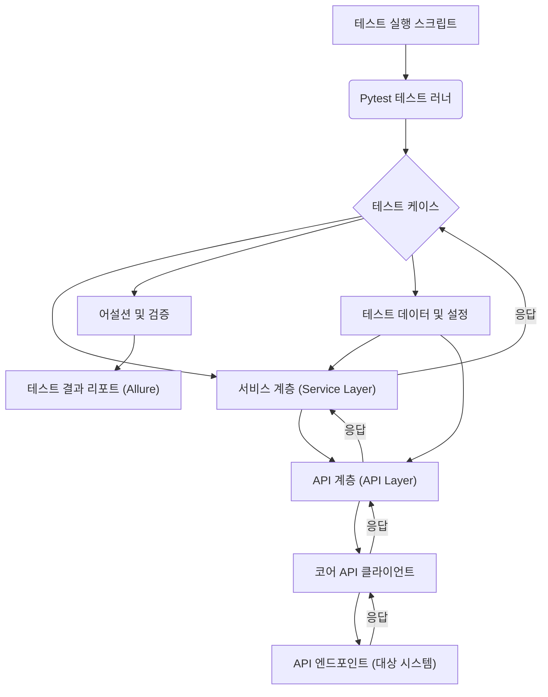

# API 자동화 테스트 프레임워크 아키텍처 문서

## 1. 개요 (Overview)

### 1.1. 문서의 목적 (Purpose of the Document)
이 문서는 API 자동화 테스트 프레임워크의 아키텍처를 설명하며, 시스템 구성 요소, 기술 스택, 데이터 흐름 및 설계 원칙을 명확히 하는 것을 목적으로 합니다. 이를 통해 프레임워크의 이해도를 높이고, 향후 유지보수 및 확장에 기여하고자 합니다.

### 1.2. 프레임워크 요약 (Framework Summary)
이 프레임워크는 `pytest`를 기반으로 구축된 API 자동화 테스트 솔루션입니다. `requests` 라이브러리를 활용하여 API 호출을 수행하며, `allure` 리포트를 통해 테스트 결과를 시각적으로 제공합니다. 모듈화된 구조와 계층별 분리를 통해 높은 유지보수성과 확장성을 제공하며, 실제 서비스 운영 환경에서 발생할 수 있는 다양한 시나리오를 테스트할 수 있도록 설계되었습니다.

## 2. 아키텍처 디자인 (Architecture Design)

### 2.1. 전체 아키텍처 다이어그램 (Overall Architecture Diagram)

**설명:**
테스트 실행 스크립트(`run_tests.sh`/`run_tests.bat`)가 `pytest` 테스트 러너를 호출하여 테스트를 시작합니다. 각 테스트 케이스는 서비스 계층을 통해 API 계층의 메서드를 호출하고, 코어 API 클라이언트를 통해 실제 API 엔드포인트와 통신합니다. API 응답은 역순으로 전달되어 테스트 케이스에서 어설션 및 검증 과정을 거칩니다. 모든 테스트 결과는 Allure 리포트를 통해 시각화됩니다. 테스트 데이터 및 설정은 서비스 및 API 계층에서 활용됩니다.

### 2.2. 구성 요소 설명 (Component Description)

*   **테스트 러너 (Test Runner):** `pytest`를 사용하여 테스트 케이스를 검색하고 실행합니다. 유연한 플러그인 아키텍처를 통해 다양한 기능을 확장할 수 있습니다.
*   **API 계층 (API Layer - `api_test/api`):** 각 API 엔드포인트에 대한 추상화 계층입니다. `base_api.py`를 상속받아 특정 도메인(예: `menu_api.py`, `order_api.py`)의 API 호출 메서드를 정의합니다. 이는 API Object Model 패턴과 유사하게 작동하여 API 호출 로직을 캡슐화합니다.
*   **코어 API 클라이언트 (Core API Client - `api_test/core/api_client.py`):** 실제 HTTP 요청(`requests` 라이브러리 사용)을 처리하고 응답을 받는 핵심 구성 요소입니다. 요청 헤더, 인증, 응답 파싱 등 공통적인 API 통신 로직을 관리합니다.
*   **서비스 계층 (Service Layer - `api_test/service`):** 비즈니스 로직과 테스트 시나리오를 정의하는 계층입니다. 여러 API 호출을 조합하여 복잡한 사용자 흐름을 시뮬레이션하거나, 특정 비즈니스 시나리오를 위한 단계를 정의(`step` 디렉토리)합니다. 이는 테스트 케이스와 API 계층 사이의 추상화 역할을 합니다.
*   **테스트 케이스 (Test Cases - `api_test/tests/scenario`):** `pytest` 프레임워크의 규칙에 따라 작성된 실제 테스트 스크립트입니다. 서비스 계층의 메서드를 호출하여 시나리오를 실행하고, `assert_model.py`를 활용하여 응답을 검증합니다.
*   **모델 (Model - `api_test/model`):** API 요청 및 응답 데이터 구조(`dto.py`), 어설션 로직(`assert_model.py`), API 응답 리포트 추가 로직(`add_api_res_report.py`), Mock 응답(`mock_res.py`) 등을 정의합니다. 데이터의 유효성 검증 및 구조화를 담당합니다.
*   **공통 유틸리티 (Common Utilities - `api_test/common`):** 테스트 전반에 걸쳐 재사용될 수 있는 유틸리티 함수나 클래스(`data_handler.py` 등)를 포함합니다.
*   **설정 (Configuration - `api_test/config`, `api_test/codes`):** API 엔드포인트 도메인(`domain.py`), 응답 코드(`response.py`), 기타 테스트 관련 설정(`settings.py`)을 관리합니다. 환경별 설정을 분리하여 유연성을 확보합니다.
*   **테스트 데이터 (Test Data):** 테스트 케이스 실행에 필요한 입력 데이터입니다. 현재는 코드 내에 정의되거나, `data_handler.py`를 통해 처리될 수 있습니다.

### 2.3. 기술 스택 (Technology Stack)

*   **언어:** Python 3
*   **패키지 관리:** Poetry
*   **테스트 프레임워크:** Pytest
*   **HTTP 클라이언트:** Requests
*   **리포트:** Allure
*   **CI/CD 스크립트:** Shell Script (`.sh`), Batch Script (`.bat`)

## 3. 데이터 흐름 및 상호 작용 (Data Flow and Interactions)

### 3.1. 테스트 실행 워크플로우 (Test Execution Workflow)

1.  **테스트 실행 트리거:** 사용자가 `scripts/run_tests.sh` (Linux/macOS) 또는 `scripts/run_tests.bat` (Windows) 스크립트를 실행합니다.
2.  **Pytest 호출:** 스크립트는 `poetry run pytest` 명령어를 통해 `pytest` 테스트 러너를 호출합니다. 이때 `allure` 리포트 생성을 위한 옵션이 함께 전달됩니다.
3.  **테스트 케이스 로드:** `pytest`는 `api_test/tests/scenario` 디렉토리 내의 테스트 케이스 파일(`test_*.py`)들을 검색하고 로드합니다.
4.  **테스트 실행:** 각 테스트 함수가 실행됩니다.
    *   테스트 함수는 `api_test/service` 계층의 특정 서비스 메서드를 호출합니다.
    *   서비스 메서드는 `api_test/api` 계층의 해당 API 메서드를 호출합니다.
    *   API 메서드는 `api_test/core/api_client.py`의 `ApiClient` 인스턴스를 사용하여 실제 대상 시스템의 API 엔드포인트로 HTTP 요청을 보냅니다.
5.  **응답 처리:**
    *   대상 시스템으로부터 HTTP 응답을 받으면 `ApiClient`가 이를 처리하고, 필요한 경우 `api_test/model/dto.py`에 정의된 DTO(Data Transfer Object) 형태로 파싱합니다.
    *   파싱된 응답은 API 계층, 서비스 계층을 거쳐 테스트 케이스로 전달됩니다.
6.  **결과 검증:** 테스트 케이스는 `api_test/model/assert_model.py`에 정의된 어설션 로직을 사용하여 API 응답의 유효성(상태 코드, 응답 본문 내용 등)을 검증합니다.
7.  **리포트 생성:** `pytest`와 `allure` 플러그인은 테스트 실행 중 발생한 정보(테스트 이름, 상태, 실행 시간, 요청/응답 데이터 등)를 수집하여 `results/allure-results` 디렉토리에 Allure 리포트 데이터를 생성합니다.
8.  **리포트 빌드:** 테스트 실행 완료 후, `allure generate` 명령어를 통해 수집된 데이터를 기반으로 `results/allure-report` 디렉토리에 HTML 형식의 시각적인 테스트 리포트가 생성됩니다.

### 3.2. 주요 상호 작용 (Key Interactions)

*   **테스트 케이스 ↔ 서비스 계층:** 테스트 케이스는 직접 API를 호출하지 않고, 서비스 계층의 메서드를 통해 비즈니스 시나리오를 실행합니다. 이는 테스트 코드의 가독성과 재사용성을 높입니다.
*   **서비스 계층 ↔ API 계층:** 서비스 계층은 특정 비즈니스 로직을 위해 하나 이상의 API 호출을 조합하거나, API 계층의 메서드를 직접 호출하여 특정 API 기능을 수행합니다.
*   **API 계층 ↔ 코어 API 클라이언트:** API 계층은 코어 API 클라이언트에게 실제 HTTP 요청을 위임합니다. 코어 API 클라이언트는 요청 전처리(헤더 추가, 인증 등) 및 응답 후처리(상태 코드 확인, 에러 처리 등)를 담당합니다.
*   **설정 파일 로드:** `api_test/config/domain.py`와 같은 설정 파일은 `api_client` 초기화 시 또는 API 호출 시 동적으로 로드되어 사용됩니다.
*   **데이터 핸들링:** `api_test/common/data_handler.py`는 테스트 데이터의 생성, 로드, 변환 등을 담당하여 테스트 데이터의 관리를 용이하게 합니다.

## 4. 설계 원칙 및 패턴 (Design Principles and Patterns)

### 4.1. 설계 원칙 (Design Principles)

*   **유지보수성 (Maintainability):**
    *   **모듈화:** API, 서비스, 테스트 케이스, 모델 등 각 기능을 독립적인 모듈로 분리하여 코드 변경 시 영향을 최소화합니다.
    *   **단일 책임 원칙 (Single Responsibility Principle):** 각 클래스와 함수가 하나의 명확한 책임만을 가지도록 설계하여 이해하기 쉽고 변경에 용이합니다.
*   **확장성 (Scalability):**
    *   새로운 API 엔드포인트나 테스트 시나리오가 추가될 때 기존 코드의 수정 없이 쉽게 확장할 수 있도록 계층별 추상화를 적용했습니다.
    *   `pytest`의 플러그인 아키텍처를 활용하여 필요에 따라 기능을 추가할 수 있습니다.
*   **재사용성 (Reusability):**
    *   공통 API 호출 로직은 `ApiClient`에, 공통 비즈니스 시나리오는 서비스 계층에, 공통 유틸리티는 `common` 디렉토리에 정의하여 코드 중복을 최소화하고 재사용성을 극대화합니다.
*   **가독성 (Readability):**
    *   명확한 파일 및 디렉토리 구조, 일관된 코딩 컨벤션을 통해 코드의 이해도를 높입니다.
    *   테스트 케이스는 시나리오 기반으로 작성되어 비즈니스 요구사항을 쉽게 파악할 수 있습니다.

### 4.2. 디자인 패턴 (Design Patterns)

*   **API Object Model (또는 Service Object Model):**
    *   웹 UI 테스트의 Page Object Model과 유사하게, 각 API 엔드포인트 또는 비즈니스 서비스 단위를 별도의 클래스로 추상화합니다 (`api_test/api`, `api_test/service`).
    *   이를 통해 테스트 케이스는 API의 내부 구현에 의존하지 않고, 비즈니스 관점에서 API를 호출할 수 있게 되어 테스트 코드의 안정성과 유지보수성이 향상됩니다.
*   **Data-Driven Testing (데이터 주도 테스트):**
    *   테스트 데이터와 테스트 로직을 분리하여, 동일한 테스트 로직으로 다양한 입력 데이터를 사용하여 테스트를 실행할 수 있도록 합니다. 현재는 `data_handler.py`를 통해 데이터 관리를 지원하며, 향후 외부 파일(CSV, Excel 등)로부터 데이터를 로드하는 방식으로 확장될 수 있습니다.

## 5. 인프라 및 환경 (Infrastructure and Environment)

### 5.1. 테스트 환경 (Test Environment)

*   **로컬 개발 환경:** 개발자의 로컬 머신에서 직접 테스트를 실행할 수 있습니다.
*   **대상 시스템:** `api_test/config/domain.py`에 정의된 도메인 설정을 통해 개발, 스테이징, 프로덕션 등 다양한 환경의 API 엔드포인트를 대상으로 테스트를 실행할 수 있습니다.

### 5.2. CI/CD 파이프라인 (CI/CD Pipeline)

현재 프레임워크는 `scripts/run_tests.sh` 및 `scripts/run_tests.bat` 스크립트를 통해 테스트 실행을 자동화합니다. 이는 Jenkins, GitLab CI, GitHub Actions 등과 같은 CI/CD 도구에 쉽게 통합될 수 있습니다.

**통합 예시:**
1.  **코드 변경 감지:** Git 저장소에 코드 변경이 푸시될 때 CI/CD 파이프라인이 트리거됩니다.
2.  **환경 설정:** 테스트 실행에 필요한 Python 환경 및 종속성(`poetry install`)을 설정합니다.
3.  **테스트 실행:** CI/CD 에이전트가 `scripts/run_tests.sh` 또는 `scripts/run_tests.bat` 스크립트를 실행하여 API 테스트를 수행합니다.
4.  **결과 리포트:** 테스트 실행 후 생성된 Allure 리포트 데이터를 CI/CD 도구의 아티팩트로 저장하거나, Allure 서버에 게시하여 테스트 결과를 시각적으로 확인할 수 있도록 합니다.
5.  **피드백:** 테스트 실패 시, 개발자에게 즉시 알림을 보내어 빠른 문제 해결을 돕습니다.

## 6. 결론 (Conclusion)

### 6.1. 요약 (Summary)

이 문서는 `pytest`, `requests`, `allure`를 기반으로 구축된 API 자동화 테스트 프레임워크의 아키텍처를 상세히 설명했습니다. 모듈화된 계층 구조, 명확한 역할 분담, 그리고 재사용 가능한 컴포넌트 설계를 통해 높은 유지보수성과 확장성을 확보했습니다. 현재 프레임워크는 기본적인 API 테스트 시나리오를 효과적으로 자동화하고 있으며, 시각적인 리포트를 통해 테스트 결과를 쉽게 파악할 수 있도록 지원합니다.

**향후 계획:**
*   **성능 테스트 통합:** API 응답 시간 임계치 검증 로직을 추가하여 성능 저하를 조기에 감지할 수 있도록 개선할 예정입니다.
*   **데이터 관리 강화:** 외부 파일(CSV, JSON 등)로부터 테스트 데이터를 로드하는 기능을 추가하여 데이터 주도 테스트의 유연성을 높일 예정입니다.
*   **더 다양한 예외 시나리오 커버리지:** 네트워크 지연, 동시성 문제 등 실제 운영 환경에서 발생할 수 있는 복잡한 예외 상황에 대한 테스트 케이스를 지속적으로 추가하고, 이에 대한 견고한 처리 로직을 검증할 예정입니다.
*   **CI/CD 파이프라인 통합 강화:** Allure 리포트 서버와의 연동을 통해 테스트 결과의 중앙 집중식 관리 및 추이 분석 기능을 강화할 예정입니다.
